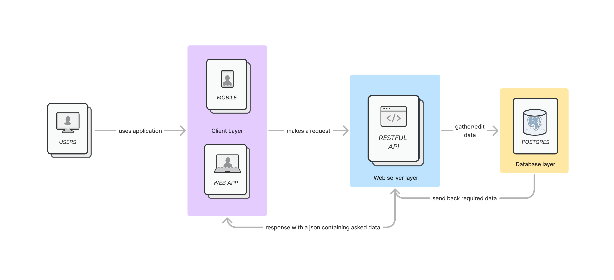

# Technical Stack

This document describes the technical stack used in the project.

## Frontend

### Vue.js

{style="display: block; margin: 0 auto"; width="150px"}

Vue.js is a progressive JavaScript framework for building user interfaces. It is designed from the ground up to be incrementally adoptable. The core library is focused on the view layer only, and is easy to pick up and integrate with other libraries or existing projects.

We chose Vue.js because it is a modern, flexible, and easy-to-use framework that allows us to build a user-friendly interface with ease. Plus, it's a lightweight framework that doesn't require a lot of setup or configuration.

### Pinia

{style="display: block; margin: 0 auto"; width="150px"}

Pinia is a modern, typed, store using the composition API. It is designed to be easy to use and understand, and to be compatible with Vue 3. It is inspired by Vuex and other libraries, but is designed to be more flexible and easier to use.

It also allows for the app to be offline first by storing the state in the browser's local storage.

### CSS

We won't use any CSS framework for this project. We will write our own CSS to have full control over the design and layout of the application.

## Backend

### Fastify

{style="display: block; margin: 0 auto"; width="150px"}

Fastify is a web framework for Node.js that is focused on providing a low overhead and high performance. It is built on top of the HTTP module in Node.js, and is designed to be fast, lightweight, and easy to use.

We chose Fastify because it is a modern, efficient, and easy-to-use framework that allows us to build high-performance web applications with ease. It is also well-documented and has a large community of users, which makes it easy to find help and support when needed.

### API Documentation

{style="display: block; margin: 0 auto"; width="150px"}

We will use OpenAPI to document the API endpoints in the project. OpenAPI is a standard for describing RESTful APIs, and provides a way to define the structure of the API, including the endpoints, parameters, responses, and more.

The generation of the API documentation will be done using a dedicated library called [fastify-swagger](https://github.com/fastify/fastify-swagger).

### API Testing

{style="display: block; margin: 0 auto"; width="150px"}

To test the API endpoints, we will use a tool called Bruno. It's very similar to Postman, but it's open-source and has a more modern interface. Plus, the free plan is more permissive than Postman's.

### Prisma ORM

{style="display: block; margin: 0 auto"; width="100px"}

Prisma is an open-source database toolkit that makes it easy to work with databases in Node.js. It provides a type-safe and auto-generated query builder that allows us to interact with the database in a more efficient and secure way.

The main advantage of Prisma is that it allows us to write database queries in a type-safe way, which helps prevent common errors and bugs that can occur when working with databases. Plus it provides security features like SQL injection prevention and data validation.

## Database

### PostgreSQL

{style="display: block; margin: 0 auto"; width="150px"}

PostgreSQL is a powerful, open-source relational database management system that is widely used in the industry. It is known for its reliability, performance, and extensibility, and is a popular choice for many web applications.

We chose it mainly because it's a largely used database system that is well-documented and has a large community of users.

## Project architecture

{style="display: block; margin: 0 auto"; width="600px"}

The project will be structured in a multirepo architecture. Each part of the project will be in a separate repository, which will allow us to work on each part independently and to scale the project more easily. The parts will be :

- Web application
- Backend API + Database
- Mobile application

## Required Tools

A bunch of tools are imposed to work on this project. Here is a list of them:

### OpenFoodFacts API

{style="display: block; margin: 0 auto"; width="100px"}

The OpenFoodFacts API is a free, open-source database of food products from around the world. It provides detailed information about the ingredients, nutritional values, and allergens of each product, and is used by millions of people every day to make informed choices about the food they eat.

### Paypal API

{style="display: block; margin: 0 auto"; width="150px"}

The Paypal API is a set of tools and services that allow developers to integrate Paypal payments into their applications. It provides a secure and reliable way to accept payments online, and is used by millions of businesses around the world.

## DevOps Technologies

### Docker

{style="display: block; margin: 0 auto"; width="150px"}

Docker is a platform for developing, shipping, and running applications in containers. It allows us to package up an application with all of its dependencies into a standardized unit for software development, and to deploy it on any platform without any changes.

### GitLab

{style="display: block; margin: 0 auto"; width="150px"}

GitLab is a web-based DevOps lifecycle tool that provides a Git repository manager, issue tracking, CI/CD pipelines, and more. It is designed to help teams collaborate on projects, automate workflows, and deliver high-quality software faster.

### GitLab Runner

{style="display: block; margin: 0 auto"; width="150px"}

GitLab Runner is an open-source project that is used to run CI/CD pipelines on GitLab. It is designed to be easy to use and configure, and to provide a fast and reliable way to build, test, and deploy applications.

## Useful links

- [Vue.js](https://vuejs.org/)
- [Pinia](https://pinia.esm.dev/)
- [Fastify](https://www.fastify.io/)
- [OpenAPI](https://swagger.io/specification/)
- [Prisma](https://www.prisma.io/)
- [PostgreSQL](https://www.postgresql.org/)
- [OpenFoodFacts API](https://openfoodfacts.github.io/openfoodfacts-server/api/ref-v2/)
- [Paypal API](https://developer.paypal.com/api/rest/)
- [Docker](https://www.docker.com/)
- [GitLab](https://about.gitlab.com/)
- [GitLab Runner](https://docs.gitlab.com/runner/)
- [Bruno](https://docs.usebruno.com/introduction/what-is-bruno)
